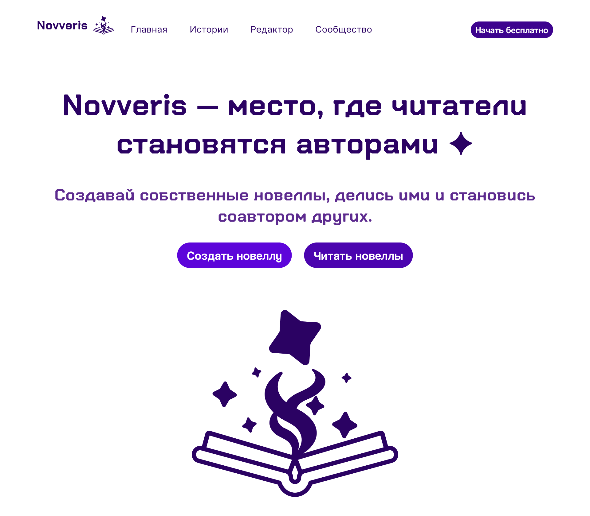

# 🌟 Novveris: Платформа для создания и публикации интерактивных новелл

[](https://github.com/danriweb/novveris)
[](https://nextjs.org/)
[](https://nestjs.com/)
[](https://www.typescriptlang.org/)

**Novveris** — **Full-Stack веб-приложение** (монорепозиторий) для создания и публикации интерактивных визуальных новелл. Концептуальный онлайн-редактор (**функционал редактора пока лишь подразумевается**).

> **ℹ️ О проекте (кратко):**
> Проект является **Pet-проектом (Showcase)**. Цель — продемонстрировать навыки полного цикла разработки продукта: от проектирования архитектуры до реализации на современном стеке (Next.js, Zustand и др.) и организации кода по FSD.
>
> Проект организован как **монорепозиторий** с использованием npm workspaces для эффективного управления frontend, backend и shared пакетами.

> **🎨 Дизайн:**
> Макет интерфейса разработан в Figma — [**посмотреть дизайн-макет**](https://www.figma.com/design/KX014Jy5H9dimGFlF97s6n/%C2%ABNovveris%C2%BB?node-id=0-1&t=50bNwWeOF0itNwGB-1)

---

## 📸 Превью приложения



---

## 📑 Навигация

- [1. Описание проекта](#1-описание-проекта)
- [2. Установка и запуск](#2-установка-и-запуск)
- [3. Архитектура проекта](#3-архитектура-проекта)
- [4. История коммитов и Conventional Commits](#4-история-коммитов-и-conventional-commits)
- [5. Технологический стек](#5-технологический-стек)
- [6. Лицензия](#6-лицензия)
- [7. Контакты](#7-контакты)

---

## 1. Описание проекта

Существующие инструменты для создания новелл требуют установки, базовых навыков программирования или лишены платформы для публикации, что создаёт высокий **порог входа** для творческих людей.

### Цели проекта

**Функциональные:**

- ✅ Создание интегрированной облачной среды для авторов визуальных новелл
- ✅ Редактор новелл с визуальным интерфейсом (в разработке)
- ✅ Платформа для публикации и чтения новелл
- ✅ Система управления проектами и ресурсами

**Технические:**

- ✅ Демонстрация архитектурных решений (FSD, монорепозиторий)
- ✅ Современный технологический стек (Next.js 16, React 19, NestJS 11)
- ✅ Высокое качество кода (ESLint, Stylelint, Prettier, Steiger)
- ✅ Масштабируемая архитектура с четким разделением ответственности
- ✅ Профессиональный подход к версионированию (Conventional Commits)

### Что реализовано дополнительно

Помимо выполнения основных требований, в проекте реализованы следующие инициативы:

- **Архитектура:** Реализована Feature-Sliced Design (FSD) архитектура с четким разделением на слои (app, pages, features, entities, shared, widgets) для обеспечения масштабируемости и поддерживаемости кода
- **Монорепозиторий:** Организация проекта через npm workspaces с разделением на frontend (Next.js) и backend (NestJS) приложения для эффективного управления зависимостями
- **Качество кода:** Настроен комплексный стек инструментов качества:
  - ESLint 9 с TypeScript и Next.js конфигурациями
  - Stylelint 16 для SCSS с плагинами для стандартизации стилей
  - Prettier для единообразного форматирования
  - Steiger для автоматической валидации FSD архитектуры в watch-режиме
- **Версионирование:** Строгое соблюдение спецификации Conventional Commits с 27 декабря 2025 года для профессионального подхода к истории изменений
- **Контейнеризация:** Docker-конфигурация с multi-stage сборкой и standalone режимом Next.js для оптимизации размера образа (~150-200MB)
- **Типобезопасность:** Полное покрытие TypeScript 5 с строгими настройками для предотвращения ошибок на этапе разработки

---

## 2. Установка и запуск

**Предварительные требования:** Node.js v18+ (рекомендуется v24+) и PostgreSQL (локально или через Docker).

**Клонирование:**

```bash
git clone https://github.com/DanriWeb/novveris.git
cd novveris
```

**Установка зависимостей:**

```bash
# npm
npm install

# yarn
yarn install

# pnpm
pnpm install
```

**Запуск приложения:**

```bash
# npm
npm run dev:frontend   # запуск фронтенда
npm run dev:backend    # запуск бэкенда

# yarn
yarn dev:frontend
yarn dev:backend

# pnpm
pnpm run dev:frontend
pnpm run dev:backend
```

**Проверка качества кода:**

```bash
# npm
npm run fe:lint        # проверка TypeScript с ESLint
npm run fe:sl          # проверка SCSS стилей с Stylelint
npm run fe:sl:fix      # автоматическое исправление SCSS стилей

# yarn
yarn fe:lint
yarn fe:sl
yarn fe:sl:fix

# pnpm
pnpm run fe:lint
pnpm run fe:sl
pnpm run fe:sl:fix
```

> **ℹ️ Конфигурация инструментов качества кода:**
>
> **ESLint 9** с следующими плагинами и конфигурациями:
>
> - `@eslint/js` — базовые правила JavaScript (recommended)
> - `typescript-eslint` — поддержка TypeScript с recommended конфигурацией
> - `eslint-config-next` — специализированные правила для Next.js
> - `eslint-plugin-unused-imports` — автоматическое удаление неиспользуемых импортов
> - `eslint-config-prettier` — интеграция с Prettier для предотвращения конфликтов
>
> **Stylelint 16.26.1** с плагинами:
>
> - `stylelint-scss` — поддержка SCSS синтаксиса
> - `stylelint-config-standard` — стандартные правила для CSS
> - `stylelint-config-standard-scss` — стандартные правила для SCSS

> 💡 **Подсказка:** Для проверки FSD-архитектуры **Steiger** автоматически запускается в режиме watch в dev-режиме.

### Docker

Проект поддерживает контейнеризацию фронтенда для упрощённого деплоя.

**Сборка Docker-образа:**

```bash
# Переход в директорию frontend
cd apps/frontend

# Сборка образа (использует .env.docker автоматически)
docker build -t novveris-frontend:latest .
```

**Запуск контейнера:**

```bash
# Запуск на порту 3001
docker run -p 3001:3000 novveris-frontend:latest
```

> ℹ️ **Конфигурация:** Переменные окружения из `.env.docker` автоматически встраиваются в образ при сборке.

> 💡 **Оптимизация:** Docker-образ использует multi-stage сборку и standalone режим Next.js, что обеспечивает размер ~150-200MB.

---

## 3. Архитектура проекта

Проект следует принципам **модульности**, **единственной ответственности (SRP)** и **разделения concerns**. Реализована Feature-Sliced Design архитектура для frontend и модульная архитектура NestJS для backend.

### Ключевые архитектурные решения

**Управление состоянием:**

- **Zustand 5.0.8** — легковесное решение для глобального состояния приложения (пользовательская сессия, UI состояние)
- **TanStack Query 5.90.12** — управление серверным состоянием, кэширование и синхронизация данных с API
- Разделение на клиентское (Zustand) и серверное (TanStack Query) состояние для оптимизации производительности
- React Server Components для рендеринга статического контента на сервере

**Поток данных:**

- **Однонаправленный поток данных** от сервера к клиенту через TanStack Query
- **RESTful API** на базе NestJS для взаимодействия frontend-backend
- Строгая типизация контрактов API через TypeScript интерфейсы
- Использование React Server Components для оптимизации начальной загрузки

**Система стилей:**

- **SCSS модули** для изоляции стилей компонентов и предотвращения конфликтов
- Глобальные переменные и миксины в `shared/styles` для единообразия дизайна
- БЭМ-подобная методология именования классов для читаемости
- Адаптивный дизайн с использованием CSS Grid и Flexbox

**API архитектура (Backend):**

- **Модульная архитектура NestJS** с разделением на feature-модули (users, projects, stories)
- Dependency Injection для слабой связанности компонентов
- **PostgreSQL** в качестве основной реляционной базы данных
- Middleware для логирования, валидации и обработки ошибок

### Структура файлов

```
novveris/
├── apps/
│   ├── frontend/          # Next.js приложение (App Router)
│   │   ├── src/
│   │   │   ├── app/       # Страницы и layouts (App Router)
│   │   │   ├── shared/    # FSD: Общие компоненты, UI-kit, утилиты
│   │   │   ├── entities/  # FSD: Бизнес-сущности (User, Project, Story)
│   │   │   ├── features/  # FSD: Функциональные возможности
│   │   │   └── widgets/   # FSD: Композитные блоки интерфейса
│   │   └── package.json
│   │
│   └── backend/           # NestJS API
│       ├── src/
│       │   ├── modules/   # Модули приложения (users, projects, stories)
│       │   ├── common/    # Общие утилиты, декораторы, guards
│       │   └── config/    # Конфигурация приложения и БД
│       └── package.json
│
├── package.json           # Root package.json с workspaces
```

---

## 4. История коммитов и Conventional Commits

**С 27 декабря 2025 года** в проекте применяется строгое соблюдение спецификации [**Conventional Commits**](https://www.conventionalcommits.org/) для демонстрации профессионального подхода к версионированию.

> **ℹ️ Примечание:** Коммиты до 27.12.2025 могут не полностью соответствовать стандарту, так как проект находился на стадии начальной разработки.

---

## 5. Технологический стек

### Основные технологии

| Технология         | Версия  | Назначение                                             |
| :----------------- | :------ | :----------------------------------------------------- |
| **React**          | 19.2.3  | Библиотека для построения пользовательского интерфейса |
| **Next.js**        | 16.0.10 | Full-stack React фреймворк с App Router и SSR          |
| **TypeScript**     | 5.x     | Типизация кода для предотвращения ошибок               |
| **NestJS**         | 11.0.1  | Прогрессивный Node.js фреймворк для backend API        |
| **PostgreSQL**     | —       | Реляционная база данных                                |
| **Zustand**        | 5.0.8   | Управление глобальным состоянием приложения            |
| **TanStack Query** | 5.90.12 | Управление серверным состоянием и кэширование          |
| **SCSS**           | 1.94.2  | Препроцессор для стилей с модульной изоляцией          |

### Инструменты разработки

| Инструмент                         | Версия  | Назначение                         |
| :--------------------------------- | :------ | :--------------------------------- |
| **ESLint**                         | 9.x     | Линтинг TypeScript/JavaScript кода |
| **Stylelint**                      | 16.26.1 | Линтинг SCSS стилей                |
| **Prettier**                       | —       | Форматирование кода                |
| **Steiger**                        | 0.5.11  | Валидация FSD архитектуры          |
| **typescript-eslint**              | 8.x     | TypeScript поддержка для ESLint    |
| **eslint-plugin-unused-imports**   | 4.3.0   | Удаление неиспользуемых импортов   |
| **@feature-sliced/steiger-plugin** | 0.5.7   | Плагин для проверки FSD правил     |

### Инфраструктура

| Технология         | Назначение                                               |
| :----------------- | :------------------------------------------------------- |
| **Docker**         | Контейнеризация frontend приложения                      |
| **npm workspaces** | Управление монорепозиторием                              |
| **concurrently**   | Параллельный запуск dev-сервера и Steiger в watch-режиме |

---

## 6. Лицензия

Этот проект распространяется под лицензией MIT. Подробности см. в файле [LICENSE](./LICENSE).

---

## 7. Контакты

Я открыт для новых предложений и карьерных возможностей. Если вас заинтересовал мой опыт или у вас есть подходящая вакансия — буду рад обсудить сотрудничество.  
Вы можете связаться со мной через следующие каналы:

| Канал связи     | Ссылка / ID                                                                         |
| :-------------- | :---------------------------------------------------------------------------------- |
| **Telegram**    | [**@danriweb_online**](https://t.me/danriweb_online)                                |
| **Email**       | [danri.web@gmail.com](mailto:danri.web@gmail.com)                                   |
| **HeadHunter**  | [Резюме на HeadHunter](https://hh.ru/resume/741ea29dff0f262c1c0039ed1f7730326d694e) |
| **Habr Career** | [Профиль на Хабр Карьере](https://career.habr.com/danriweb)                         |

---

## 🚀 Другие проекты

Если вам интересны мои другие работы:

- [**Flight Services**](https://github.com/DanriWeb/flight-services#readme) — SPA для поиска и бронирования авиабилетов с интеграцией внешнего API. Демонстрирует работу с REST API, управление состоянием и адаптивный дизайн
- [**Freelance Calculator**](https://github.com/DanriWeb/freelance-calculator#readme) — SPA-калькулятор для расчета стоимости фриланс-услуг. Реализован на React 19 с TypeScript, демонстрирует работу с формами и валидацией
- [**SCSS Navigator**](https://github.com/DanriWeb/vscode-scss-navigator#readme) — VS Code расширение для навигации по SCSS/SASS файлам с поддержкой path aliases из tsconfig.json. Обеспечивает переход к определениям переменных, миксинов и функций через Ctrl+Click

---

**Дата создания:** 11 декабря 2025  
**Последнее обновление:** 29 декабря 2025
